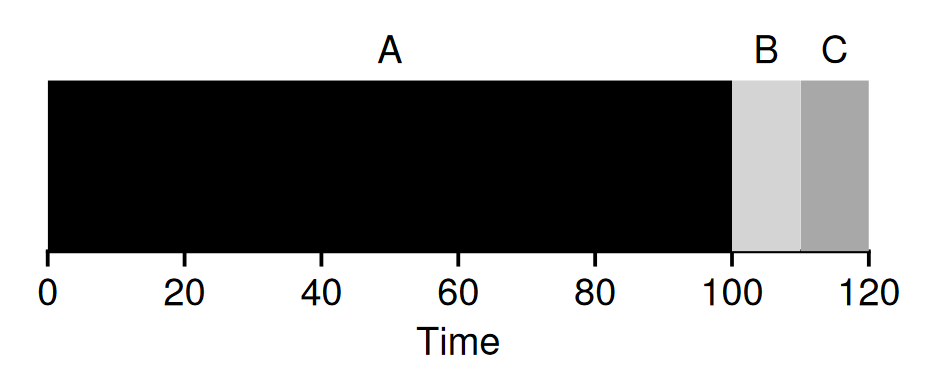
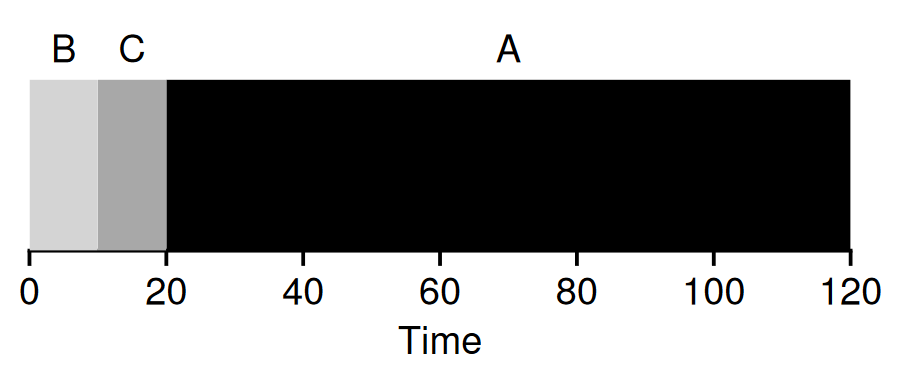
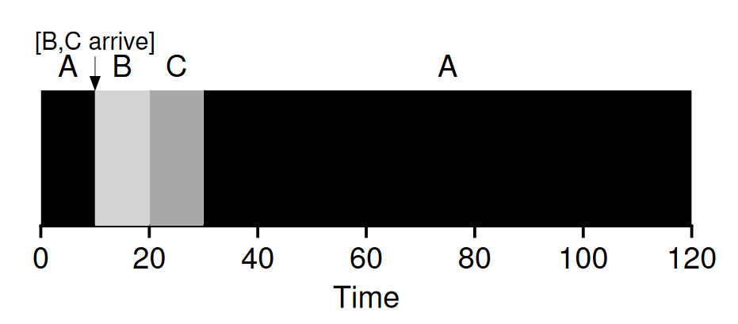
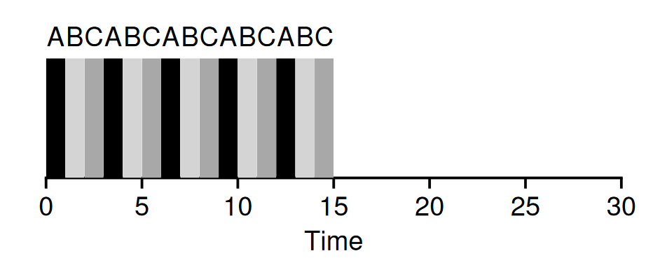
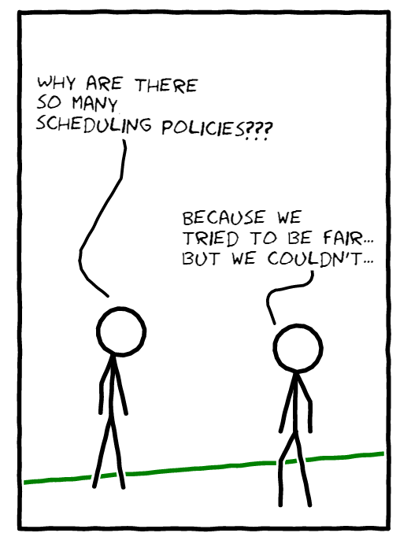

These wooden ducks look so decourous in a proper line! They depict order and mannerism. A single duck getting out of line can create chaos and a mess. Though not as precisely as in this picture, ducks in nature do follow order and avoid chaos. Aside from the poopy mess they create, if you ever had them as pets, we want our cpu scheduler to be just like that; avoiding chaos and mess.

Without diving into the philosophical definitions of order and chaos, as tempting as it may be, we'll explore the basic foundations of scheduling mechanisms operating systems use. I realized it won't be as much fun to read a pompous writing, so I am thrilled to tell you that there will be some action as well. We'll write our cpu scheduler in C language as we go along the exploratory path. If you've personal grudges against the C language, fear not, we'll try for a smooth sailing!

You want your computer to run multiple programs (we'll call them processes) and not just run them, but switch between them without any delays. You would not want to see your computer lagging when opening your favorite browser along with a text editor. This demands some mechanism which schedules these processes properly. Such a mechanism is called CPU scheduling. The term CPU scheduling does not imply that the scheduling is done solely by CPU. Operating systems have a big role to play in scheduling processes on a CPU.

> Nowhere in this article or its sequels, do we think about multi-processing. As a wise person said, complexity breeds obscurity.

## First come, first serve

The simplest of these policies is using a queue (First In First Out). Think of the checkout line in a grocery store. Three people (**A**lice, **B**ob and **C**lara) are standing in the queue. **A**lice is on the front taking 100 seconds to checkout all her items. While the other two persons (**B**ob & **C**lara) will just take 10 seconds each, they still need to wait until **A**lice is finished. Our first policy implementation is going to be FIFO. A good rule of thumb is to start simple and gradually increase the complexity!

<em style="display:block;text-align:center;">FIFO Policy. Credits: OS: Three Easy Pieces</em>

## Serve those who take less time

Assuming all three came at the same time, can we let **B**ob and **C**lara go ahead first and finish their checkout? I know, it seems unfair, but let's switch the context to computers. You'd want a task taking less time to complete first, no? That's what this type of scheduling policy is going to achieve. Known as Shortest Job First (SJF), this policy works on the assumption that a shorter job has a higher priority and thus be executed first. What seems unfair in the grocery line is actually fair in case of computers, for your benefit!

<em style="display:block;text-align:center;">SJF Policy. Credits: OS: Three Easy Pieces</em>

## Serve those who take less time, even if they come late

Sorry to give you a bummer, but the SJF policy is dumb. It assumes that all people (read jobs/processes/tasks) come at the same time. That's not how a real world works. People come at random times in the grocery line after they're finished shopping. Let's be unfair again to people who came early but will take a lot of time. Let's be real, the world is not fair, and neither can our imaginary world be. Ummm actually, we're going to be a little more harsh. If a job **A** is running and jobs **B** and **C** come in at 10th second, the schedular will recognize that **A**lice is still going to take more time (80 more seconds) than **B**ob and **C**lara, and following conversation will happen:

Schedular: *Hi **A**lice, sorry to interrupt you in the middle but seems like you are going to take too long to finish, so how about you get back at the end of the queue and let **B**ob and **C**lara finish first.*

**A**lice: *No I won't!*

Schedular: *I wasn't asking* 😈

This type of scheduling policy is called Shortest Time to Completion First (STCF) and also called a preemptive version of SJF. That is, a longer job preemptively stops to make time for incoming shorter jobs. As always, an illustration is a thousand times better:

<em style="display:block;text-align:center;">STCF Policy. Credits: OS: Three Easy Pieces</em>

## Serve everyone equally!

We started with a simple FIFO, which was biased towards longer running jobs. Next we explored SJF, which solved the previous problem, but which naively assumed that all jobs were coming at the same time. To tackle that, we came up with STCF, which gave shorter jobs more privilige, even when they came late. Hmmm wait! Do you smell the problem? Do you feel like the processes are not given an equal chance? *If you smelled a different problem, you're probably ahead of this article :)*

Well, that's what those programmers thought who came up with the Round Robin scheduling policy. Why not give every job an equal time before they preemptively stop to let the next job run for the same amount of time? This is called time-sharing or time-slice-sharing and Round Robin is based on this concept. See the figure below, every job is given a time slice of 1 second (it can be any constant). Once the job has used up its time slice and there are other jobs waiting in queue, it stops and goes to the end of the queue. Our scheduler must have secured a heaven for such a Robin Hood act!

<em style="display:block;text-align:center;">RR Policy. Credits: OS: Three Easy Pieces</em>

## Wrapping up & Moving on to Implementation

Is RR the best policy? Of course not, there are problems with RR algorithm (*policy == algorithm*) which are addressed by more complex algorithms such as Multi Level Feedback Queue, Lottery Scheduling, Completely Fair Scheduling (it's not completely fair to be honest), Brain F**k Scheduler (yes it exists) and others which are out of the scope of this post. But what's good about what we've covered so far is that these are fundamentals, and they're the origin of smart scheduling algorithms that operating systems use today. That's why we're going to stick to these four algorithms (or policies) in our implementation. See you in the [next article](../simulating-cpu-scheduler-pt-2) series where we do some action!

<em style="display:block;text-align:center;">The Fairness Dilemma. Created using <a href="http://cmx.io" target="_blank">cmx.io</a></em>
