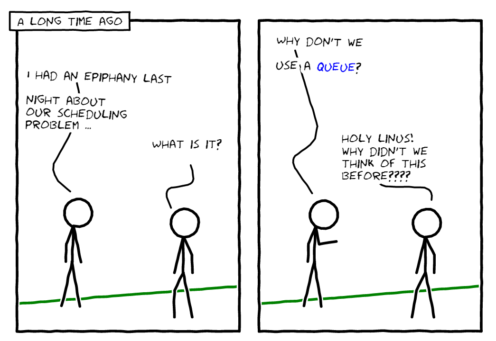

<em style="display:block;text-align:center;">A long time ago</em>

We've so far discussed the four policies in [my first article](../simulating-cpu-scheduler) and the initial setup in [my second article](../simulating-cpu-scheduler-pt-2). Your sleeves should be rolled up by now. If not, give a read on my first two posts and then come back!

> All the code is already on this [Github repo](https://github.com/FarooqAR/sim_schedular) and I am happy to receive contributions!

## Implementing the FIFO Policy
Let's cut through the chatter and dive into the algorithm:

1. Take the processes' queue `PQ` as an input
2. Create three variables for the currently running process `current`, a ready queue `RQ` and a counter for `time`.
3. Keep doing the following until `PQ`, `RQ` and the `current` process have become empty:
    - See which processes in `PQ` arrived at `time`. Put them in `RQ`
    - <span id="second-step"></span>Update the `current` process
    - Print the current state of CPU with [the required format](../simulating-cpu-scheduler-pt-2#output-format)
    - Decrement `current`'s [time to completion](../simulating-cpu-scheduler-pt-2#process-structure) since it has consumed 1 unit of time
    - Increment the `time`

If you understand this algorithm and the code, you can easily follow for SJF and STCF as well, since they're only a slight variations of the FIFO policy. Housekeeping stuff aside, the code is pretty simple.

```c
void run_fifo(struct node * head, bool is_sjf) {
    struct process * current = NULL;
    struct node * ready_q_head = NULL;
    int ready_q_size = 0;
    int time = 1;
    while (head != NULL || current != NULL || ready_q_head != NULL) {
        struct node * tmp = head;
        while (tmp != NULL) {
            if (tmp->p->toa == time - 1) {
                if (current == NULL) {
                    current = dequeue(&tmp); 
                }
                else {
                    struct process * p = dequeue(&tmp);
                    // we may want to enqueue only if ttc > 0
                    enqueue(&ready_q_head, p->name, p->pid, p->ttc, p->toa);
                    ready_q_size++;
                    if (is_sjf) {
                        sort_by_duration(&ready_q_head, ready_q_size);
                    }
                    free_process(p);
                }
                // Dequeue operation deletes current node at `tmp` 
                // and update `tmp` with `tmp->next`, 
                // this means the node `head` becomes dangling
                // so we need to manually update `head` 
                head = tmp;
            } 
            else {
                tmp = tmp->next;
            }
        }
        if (current != NULL) {
            if (current->ttc <= 0) {
                free_process(current);
                if (ready_q_head == NULL) {
                    break;
                }
                current = dequeue(&ready_q_head);
                ready_q_size--;
            }
            if (current != NULL) {
                if (current->ttc == 0)
                    fprintf(stdout, "%d:idle:", time);
                else 
                    fprintf(stdout, "%d:%s:", time, current->name);
                
                print_ready_q(ready_q_head);
                fprintf(stdout, "\n");
                current->ttc--;
            } else {
                fprintf(stdout, "%d:idle:empty:\n", time);    
            }
        } else {
            fprintf(stdout, "%d:idle:empty:\n", time);
        }
        time++;
    }

}
```

## Implementing the SJF Policy

See the first sub-step of the 3rd step in the previous section. One addition we can make here is that we always keep the ready queue `RQ` in sorted order. Remember in SJF, the shortest job is given the most attention. That's what we did here through sorting and that's all we need to convert the FIFO policy into SJF. In the [code](https://github.com/FarooqAR/sim_schedular/blob/master/sched.c#L87), we have added an additional flag `is_sjf` to achieve this.

## Implementing the STCF Policy

We are on an easy ride here. The STCF policy is similar to SJF with an additional step of checking to see if the current process is shorter than the ready processes. If it is, keep going, otherwise, move it to the ready queue and update the current process with the shortest job in ready queue. The ready queue needs to be sorted again. [This part](https://github.com/FarooqAR/sim_schedular/blob/master/sched.c#L124) of the code does all of that.

## Implementing the RR Policy

The crux of Round Robin scheduling is time-sharing. We assume the time slice is 1 unit of time. The algo lyrics are again similar and the only difference is the addition of following step before the <span id="second-step-click">[2nd step](#second-step)</span> in the iteration:

- If `current` is not empty, put it at the end of ready queue

If you haven't figured it out, we are switching to the next ready process at every unit of time. If there is only one process, it gets all the time slices.

<script>
document.getElementById("second-step-click").onclick = function() {
    document.getElementById("second-step").parentNode.style.backgroundColor = "#0080002b";
}
</script>

## Conclusion

The beauty of these studying these scheduling algorithms is the nostalgic insights one get on how early programmers tackled the scheduling problems. In this three part series, we got to look at the four basic algorithms which essentially became the basis of more complex algorithms. For example, the multi-level feedback queue is a combination of multiple queues and RR policy. CFS (Completely Fair Scheduling) is yet another algorithm which is similar to RR but with varied time slices. It also has user-defined process priorities which are accomplished through `niceness` parameter(s).

As with any basic solution, the four algos come with problems which make them unfit for practical use. The purpose of this series was not to shed light on those problems and edge cases, but to cover the minimal grounds. I hope I did a good job there.

If you found this article useful, follow me on [twitter](https://twitter.com/farooq_ar).