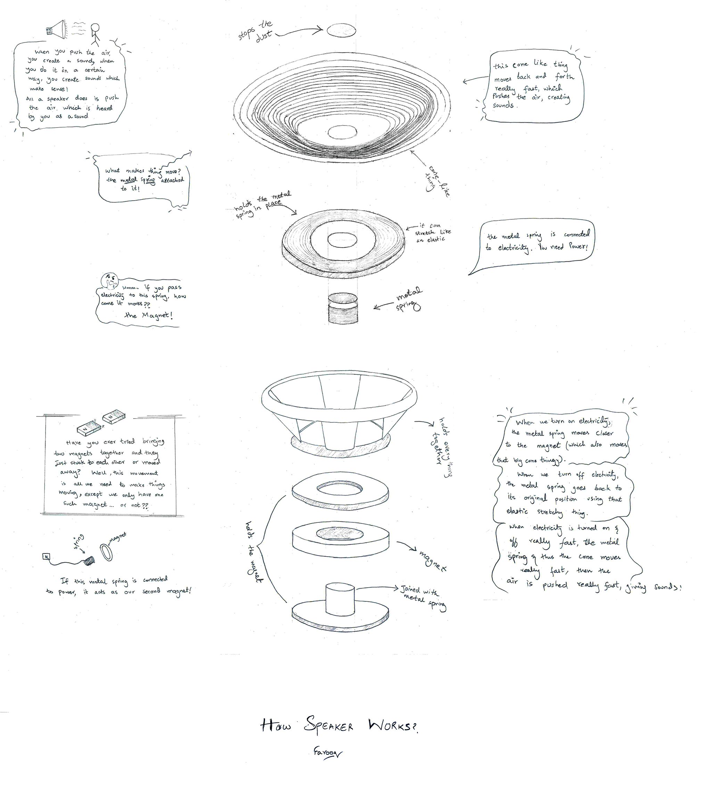

I created this "thing explainer" as part of my undergrad course called Science Technology & Society. Inspired from Randall Monroe's [Up Goer Five](https://xkcd.com/1133/) and [Thing Explainer](https://xkcd.com/thing-explainer/), the objective was to use a very simple language in explaining a scientific concept or a thing. I chose a speaker. "Hmmm, how hard is it going to be?", I thought. I tried it and I have to say, it was a bit of struggle finding simple words at start. But it turned out to be hella fun!

*That cone thing puts me off every time I look at it. It doesn't look ... cony.*

*If this doesn't look like a speaker to you on first look, I didn't do a good job. If this resembles some dope tech for you, I am still proud.*